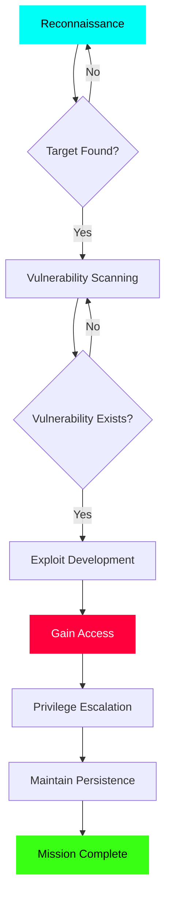
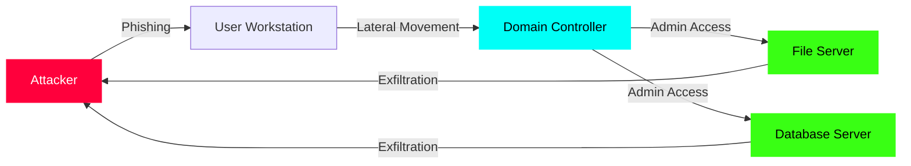
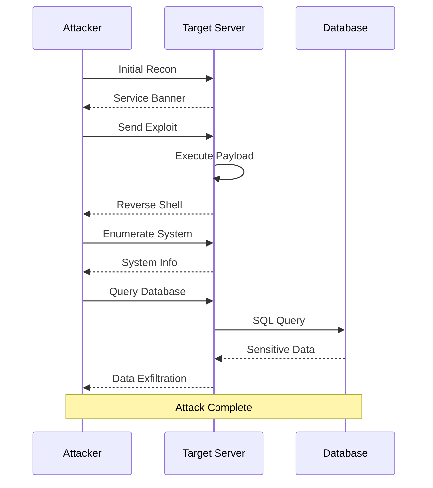

Quick reference guide for Markdown syntax with examples. Because even hackers need documentation.

## Headers

```markdown
# H1 Header
## H2 Header
### H3 Header
#### H4 Header
##### H5 Header
###### H6 Header
```

## Text Formatting

```markdown
**Bold text**
*Italic text*
***Bold and italic***
~~Strikethrough~~
`Inline code`
```

**Bold text**  
*Italic text*  
***Bold and italic***  
~~Strikethrough~~  
`Inline code`

## Lists

### Unordered Lists

```markdown
- Item 1
- Item 2
  - Nested item
  - Another nested item
- Item 3
```

- Item 1
- Item 2
  - Nested item
  - Another nested item
- Item 3

### Ordered Lists

```markdown
1. First item
2. Second item
3. Third item
   1. Nested item
   2. Another nested item
```

1. First item
2. Second item
3. Third item
   1. Nested item
   2. Another nested item

## Links and Images

```markdown
[Link text](https://example.com)
[Link with title](https://example.com "Title text")


```

## Code Blocks

### Inline Code

Use backticks: `code here`

### Code Blocks with Syntax Highlighting

````markdown
```python
def exploit():
    print("Getting shell...")
    return shell
```

```bash
#!/bin/bash
echo "Pwned!"
```
````

```python
def exploit():
    print("Getting shell...")
    return shell
```

```bash
#!/bin/bash
echo "Pwned!"
```

## Blockquotes

```markdown
> Single line quote
> 
> Multi-line quote
> continues here
> 
> > Nested quote
```

> Single line quote
> 
> Multi-line quote
> continues here
> 
> > Nested quote

## Tables

```markdown
| Header 1 | Header 2 | Header 3 |
|----------|----------|----------|
| Cell 1   | Cell 2   | Cell 3   |
| Cell 4   | Cell 5   | Cell 6   |

| Left align | Center align | Right align |
|:-----------|:------------:|------------:|
| Left       | Center       | Right       |
```

| Header 1 | Header 2 | Header 3 |
|----------|----------|----------|
| Cell 1   | Cell 2   | Cell 3   |
| Cell 4   | Cell 5   | Cell 6   |

| Left align | Center align | Right align |
|:-----------|:------------:|------------:|
| Left       | Center       | Right       |

## Horizontal Rules

```markdown
---
***
___
```

---

## Task Lists

```markdown
- [x] Recon phase complete
- [x] Exploit developed
- [ ] Get shell access
- [ ] Maintain persistence
- [ ] Exfiltrate data
```

- [x] Recon phase complete
- [x] Exploit developed
- [ ] Get shell access
- [ ] Maintain persistence
- [ ] Exfiltrate data

## Mermaid Diagrams

You can create flowcharts, sequence diagrams, and more with Mermaid:

### Attack Flow Diagram



### Network Topology



### Sequence Diagram



## Escaping Characters

Use backslash to escape special characters:

```markdown
\* Not italic \*
\# Not a header
\`Not code\`
\[Not a link\]
```

## HTML in Markdown

You can also use HTML directly in Markdown:

```html
<div style="color: #00fff7;">
  Custom styled text
</div>

<details>
  <summary>Click to expand</summary>
  Hidden content here
</details>
```

<details>
  <summary>Click to expand</summary>
  Hidden content here - useful for long code snippets or detailed explanations!
</details>

## Quick Tips

1. **Preview as you write** - Most editors support live Markdown preview
2. **Use relative links** for internal documentation
3. **Keep it simple** - Markdown is meant to be readable as plain text
4. **Tables can be tricky** - Use a generator if needed
5. **Mermaid diagrams** - Great for documenting attack paths and architectures

## Useful Resources

- [GitHub Markdown Guide](https://guides.github.com/features/mastering-markdown/)
- [Markdown Cheatsheet](https://github.com/adam-p/markdown-here/wiki/Markdown-Cheatsheet)
- [Mermaid Documentation](https://mermaid-js.github.io/)

---

**Pro tip:** Most documentation platforms support Markdown. Master it once, use it everywhere - from GitHub README files to internal security documentation.
